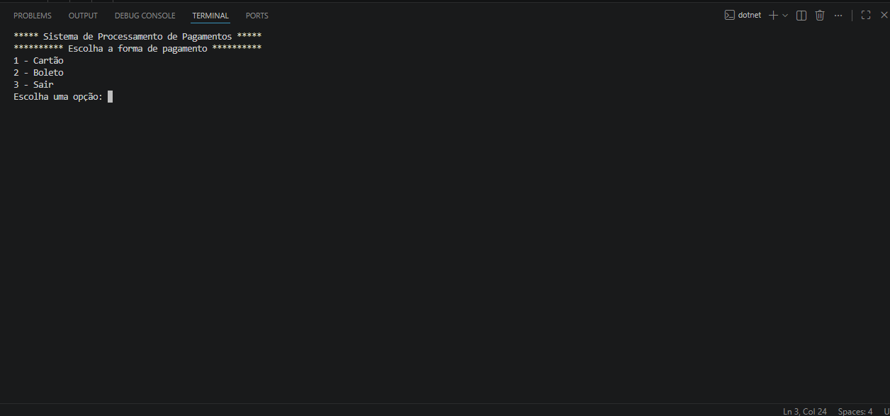
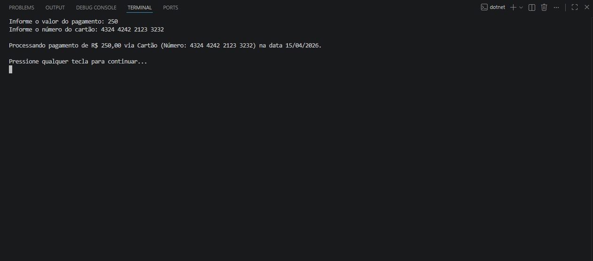
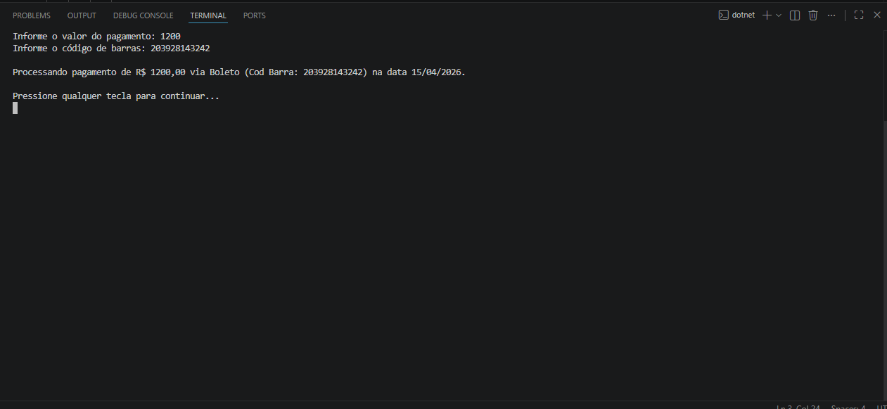

# Sistema de Processamento de Pagamentos

## Descrição

Este projeto consiste em uma aplicação console desenvolvida em C# que simula um sistema de processamento de pagamentos. O sistema permite ao usuário escolher entre pagamento via Cartão ou Boleto, coletar os dados necessários e exibir um resumo da operação realizada.

---

## Integrantes

* Augusto Rocha - RM556316
* Wendell Dos Santos Silva - RM558859
* Guilherme Vieira - RM557264
* Erik Yuuta Goto - RM558076


<!-- Adicione outros nomes aqui, se necessário -->

---

## Tecnologias Utilizadas

* C#
* .NET
* Programação Orientada a Objetos (POO)

---

## Funcionalidades

* Menu interativo no console
* Processamento de pagamento com:

  * Cartão
  * Boleto
* Validação de entrada de valor
* Exibição de resumo da transação com data

---

## Estrutura do Projeto

```
ProjetoPagamento
 ├── Pagamentos/
 │    ├── Pagamento.cs
 │    ├── PagamentoCartao.cs
 │    └── PagamentoBoleto.cs
 ├── Program.cs
 ├── Menu.cs
 ├── ProjetoPagamento.csproj
```

---

## Como Executar

1. Clonar o repositório:

```
git clone https://github.com/SEU-USUARIO/projeto-pagamentos.git
```

2. Acessar a pasta do projeto:

```
cd ProjetoPagamento
```

3. Executar o projeto:

```
dotnet run
```

---

## Exemplos de Uso

### Pagamento com Cartão

```
Processando pagamento de R$ 150,50 via Cartão (Número: 1234-5678-9012-3456) na data 01/01/2025.
```

### Pagamento com Boleto

```
Processando pagamento de R$ 150,50 via Boleto (Cod Barra: 1111111122222223333333344444444) na data 01/01/2025.
```

---

## Evidências de Testes

### Menu Principal



### Pagamento com Cartão



### Pagamento com Boleto



---

## Observações

* O sistema foi desenvolvido com base em conceitos de Programação Orientada a Objetos.
* Foi utilizada uma classe abstrata para representar o pagamento e classes derivadas para os tipos específicos.
* A estrutura foi organizada em pastas visando melhor organização e manutenção do código.

---
